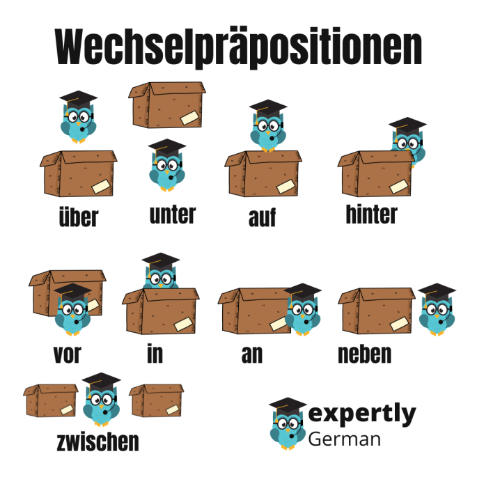
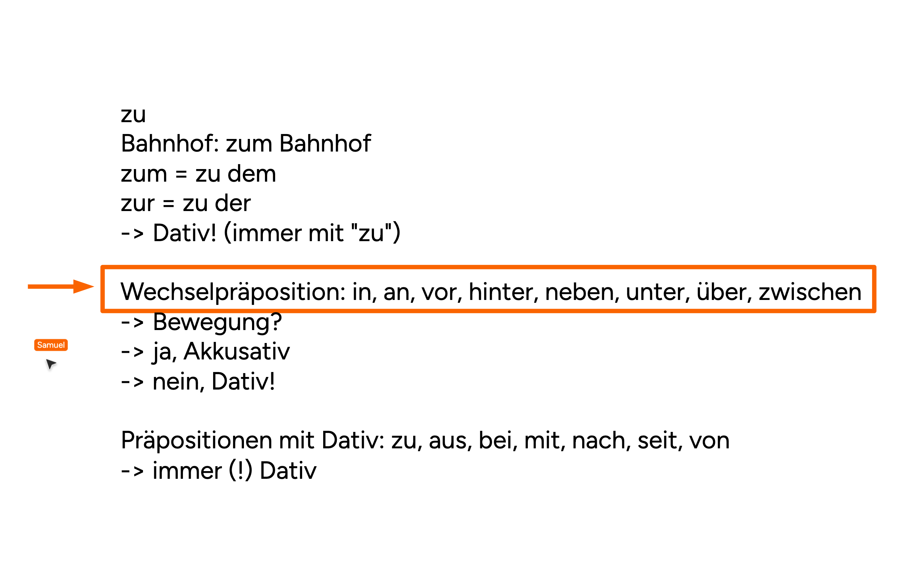

# Wechselpräpositionen (Two-way prepositions)

---

**Wechselpräpositionen** can take **either the Accusative or the Dative**, depending on the meaning.

## The 9 Wechselpräpositionen

```
in · an · auf · vor · hinter · neben · unter · über · zwischen
```




*Image credit: [Expertly German — German Prepositions](https://expertlygerman.com/2020/10/08/german-prepositions/).*

Each preposition marks a position relative to a box: über, auf, in, an, hinter, neben, zwischen, unter, vor.

## The Rule — Akkusativ or Dativ?

Ask one question: **Is there movement (Bewegung) towards a goal?**

| Question | Case | Asks | Meaning |
|----------|------|------|---------|
| **Bewegung? → ja** | **Akkusativ** | **wohin?** *(where to?)* | direction / movement to a place |
| **Bewegung? → nein** | **Dativ** | **wo?** *(where?)* | position / location |

> **Wohin?** *(movement)* → Akkusativ
> *Ich stelle die Lampe **auf den** Tisch.* — I put the lamp on**to** the table.
>
> **Wo?** *(position)* → Dativ
> *Die Lampe steht **auf dem** Tisch.* — The lamp is standing on the table.

### All 9 prepositions — simple placement verbs

These are the everyday verbs from A2. The **movement** verb (Akkusativ) and the **position** verb (Dativ) are shown together — only the article changes.

| Präp. | Verb (Akk → Dativ) | Akkusativ — **wohin?** (movement) | Dativ — **wo?** (position) |
|-------|--------------------|-----------------------------------|----------------------------|
| **in**      | stecken         | Ich stecke das Handy **in die** Tasche. *(I put the phone into the bag.)* | Das Handy steckt **in der** Tasche. *(The phone is in the bag.)* |
| **an**      | hängen          | Ich hänge das Bild **an die** Wand. *(I hang the picture onto the wall.)* | Das Bild hängt **an der** Wand. *(The picture hangs on the wall.)* |
| **auf**     | legen → liegen  | Ich lege das Buch **auf den** Tisch. *(I put the book onto the table.)* | Das Buch liegt **auf dem** Tisch. *(The book is on the table.)* |
| **über**    | hängen          | Ich hänge die Lampe **über den** Tisch. *(I hang the lamp above the table.)* | Die Lampe hängt **über dem** Tisch. *(The lamp hangs above the table.)* |
| **unter**   | legen → liegen  | Ich lege die Schuhe **unter das** Bett. *(I put the shoes under the bed.)* | Die Schuhe liegen **unter dem** Bett. *(The shoes are under the bed.)* |
| **vor**     | stellen → stehen| Ich stelle das Fahrrad **vor das** Haus. *(I put the bike in front of the house.)* | Das Fahrrad steht **vor dem** Haus. *(The bike is in front of the house.)* |
| **hinter**  | stellen → stehen| Ich stelle den Stuhl **hinter den** Tisch. *(I put the chair behind the table.)* | Der Stuhl steht **hinter dem** Tisch. *(The chair is behind the table.)* |
| **neben**   | stellen → stehen| Ich stelle die Tasse **neben den** Teller. *(I put the cup next to the plate.)* | Die Tasse steht **neben dem** Teller. *(The cup is next to the plate.)* |
| **zwischen**| setzen → sitzen | Ich setze mich **zwischen die** Kinder. *(I sit down between the children.)* | Ich sitze **zwischen den** Kindern. *(I sit between the children.)* |

> **The verb pairs** — movement vs. position:
> **legen → liegen** *(lay → lie)* · **stellen → stehen** *(stand up → stand)* · **setzen → sitzen** *(set → sit)*.
> **hängen** and **stecken** keep the **same form** for both cases.
>
> Dativ plural adds **-n**: *zwischen **den Kindern***. Contractions: *an dem → **am***, *in dem → **im***.

---

## Compare — the other prepositions

These are **not** Wechselpräpositionen; the case is always fixed:

| Group | Prepositions | Case |
|-------|--------------|------|
| **Immer Dativ** | zu, aus, bei, mit, nach, seit, von | always **Dativ** |
| **Immer Akkusativ** | durch, für, gegen, ohne, um | always **Akkusativ** |

### "zu" is always Dativ

```
zum = zu dem        zur = zu der
```

> *Ich gehe **zum** Bahnhof.* — I go to the station. *(immer mit "zu" → Dativ)*

---

## Quick Formula

```
Wechselpräposition + Bewegung (wohin?) → Akkusativ
Wechselpräposition + Position  (wo?)   → Dativ
```

*Based on the notes in .*
